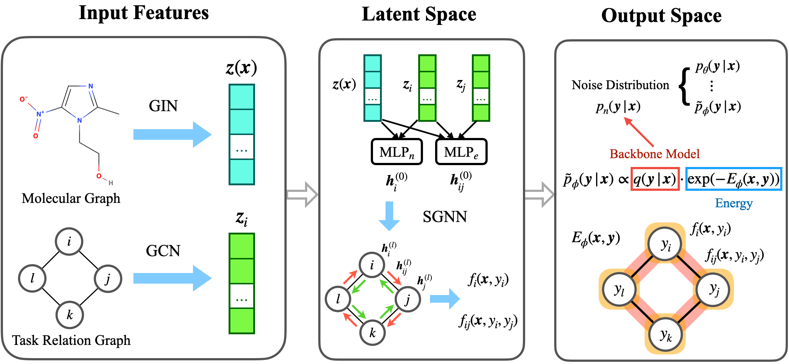

# Structured Multi-task Learning for Molecular Property Prediction

**AISTATS 2022**

Authors: Shengchao Liu, Meng Qu, Zuobai Zhang, Huiyu Cai, Jian Tang

[[Project Page](https://chao1224.github.io/SGNN-EBM)]
[[Paper]()]
[[ArXiv]()]
[[Code](https://github.com/chao1224/SGNN-EBM)]
[[NeurIPS AI4Science Workshop 2021](https://openreview.net/forum?id=6cWgY5Epwzo)]

This repository provides the source code for the AISTATS'22 paper **Structured Multi-task Learning for Molecular Property Prediction**, with the following contributions:
1. To our best knowledge, we are the **first** to propose a new research problem: multi-task learning with an explicit task relation graph;
2. We construct a domain-specific multi-task dataset with relation graph for drug discovery;
3. We propose **state graph neural network-energy based model (SGNN-EBM)** for task structured modeling in both the latent and output space.

<p align="center">
   
</p>

## Baselines
For implementation, this repository also provides the following multi-task learning baselines:
- standard single-task learning (STL)
- standard multi-task learning (MTL)
- [Uncertainty Weighing (UW)](https://openaccess.thecvf.com/content_cvpr_2018/papers/Kendall_Multi-Task_Learning_Using_CVPR_2018_paper.pdf)
- [GradNorm](https://proceedings.mlr.press/v80/chen18a.html)
- [Dynamic Weight Average (DWA)](https://openaccess.thecvf.com/content_CVPR_2019/papers/Liu_End-To-End_Multi-Task_Learning_With_Attention_CVPR_2019_paper.pdf)
- [Loss-Balanced Task Weighting (LBTW)](https://ojs.aaai.org//index.php/AAAI/article/view/5125)


## Environments
Below is environment built with [pytorch-geometric](https://github.com/pyg-team/pytorch_geometric).
In the future, we will merge it into the [TorchDrug](https://github.com/DeepGraphLearning/torchdrug) package.

```
conda create -n SGNN_EBM python=3.7
conda activate SGNN_EBM
conda install -y -c pytorch pytorch=1.6.0 torchvision
conda install -y matplotlib
conda install -y scikit-learn
conda install -y -c rdkit rdkit=2019.03.1.0
conda install -y -c anaconda beautifulsoup4
conda install -y -c anaconda lxml

wget https://data.pyg.org/whl/torch-1.6.0%2Bcu102/torch_sparse-0.6.9-cp37-cp37m-linux_x86_64.whl
wget https://data.pyg.org/whl/torch-1.6.0%2Bcu102/torch_scatter-2.0.6-cp37-cp37m-linux_x86_64.whl
wget https://data.pyg.org/whl/torch-1.6.0%2Bcu102/torch_spline_conv-1.2.1-cp37-cp37m-linux_x86_64.whl
wget https://data.pyg.org/whl/torch-1.6.0%2Bcu102/torch_cluster-1.5.9-cp37-cp37m-linux_x86_64.whl
pip install torch_sparse-0.6.9-cp37-cp37m-linux_x86_64.whl
pip install torch_scatter-2.0.6-cp37-cp37m-linux_x86_64.whl
pip install torch_spline_conv-1.2.1-cp37-cp37m-linux_x86_64.whl
pip install torch_cluster-1.5.9-cp37-cp37m-linux_x86_64.whl
pip install torch-geometric==1.6.*
```


## Dataset

Check [this instruction](https://github.com/chao1224/SGNN-EBM_dev/blob/main/datasets/README.md).

## Multi-Task Learning

